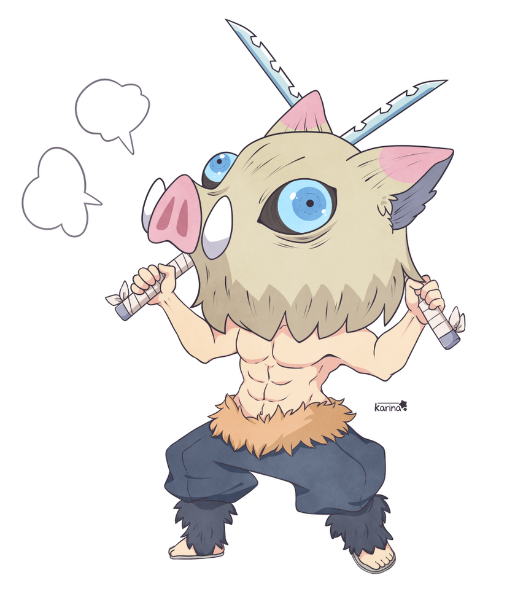

## Oi, eu sou o Breno
#### But you can call me Brian
 

  

    -📒 I'm studying ReactJs. 
    -🛠️ Working as a junior web developer. 
    -🌎 Interested on all technologies. 
    -😄 Looking forward to meet new people.
  

  

 

  <a href="https://github.com/brenoalexandre"><a/>
    
    <!---->
  

  ##
   
 
  
-🎶 Bora ouvir uma Fresno?

  

